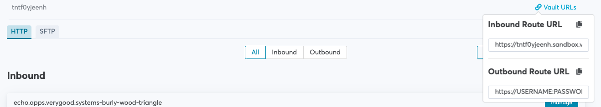

# Browser Proxy Demo

Once you have data securely vaulted within VGS, you may want to manually enter it into a web form in order to send it to a third party - for example, entering a credit card number into a merchant's website on behalf of a customer. Follow these steps to see how you can do so while keeping your employees, hardware, and network from ever having to handle sensitive data. 

To illustrate this use case, we're going to use this [mock data input form](https://vgs-browser-proxy-demo.herokuapp.com/). All the site does is display what the server receives when you hit "submit". The goal of this demo is to show how you can enter a VGS alias into that form, and have the server receive the raw secret. 

Note: This application is for illustrative purposes only and is not suitable for handling live data. Do not at any point enter real sensitive values into any of the forms you will see in this demo. 

## Requirements
* A VGS vault
* A web browser - Mozilla Firefox is recommended but this demo will work with other browsers, although it may be harder to configure

## Route setup

Note: As an alternative to setting up the routes yourself, you can upload the "inbound.yaml" and "outbound.yaml" files in the "/configurations" directory to your vault.

Sign in to the VGS dashboard and open the route configurations. We'll first need a way to put data into the VGS. Create an inbound route:

Leave all of the settings at the default values and click save in the bottom-right corner. 

Time to create the outbound route. Remember, the goal is to intercept form data bound for our test website, and replace the VGS alias with the real value. Create an outbound route:

Set the upstream host to https://vgs-browser-proxy-demo.herokuapp.com:

Add a filter to reveal the "secret" field within the form data:

Save this route. 

For the next steps, you will need three pieces of information from the VGS Dashboard:

- The username and credentials for your vault. These are displayed when you create the vault; if you have lost them, click "Settings" on the right panel, go to "Access Credentials", and create new ones. 
- Your vault ID. This can be found towards the top of the page and beings with "tnt". If you click on it, it will automatically copy to your clipboard.
- Your outbound vault URL. You can find this by clicking "Vault URLs" in the top right.

See the image below for where to find the vault ID and outbound URL:

## Store data within VGS

We will need a VGS token corresponding to a piece of data stored in your vault. One convient way to create one is by using [this site](http://vgs-tokenizer.herokuapp.com/). Because you created an inbound route with the default configuration in the previous step, you just need to enter your VGS Vault ID and a secret string of your choice into the form. When you click "Submit", the page will send the string to VGS and display the token generated. Copy the token this page displays.

## Configure Firefox to Use The VGS Forward Proxy

Open up the Firefox preferences, scroll down to "Network Settings" under "General", and click "Settings...". Select "Manual proxy configuration", and enter your vault URL in the HTTP proxy and HTTPS proxy fields as shown in the image below. Note that you will have to remove the "https://USERNAME:PASSWORD@" and "port" parts of the URL you got from VGS, and enter the port number into the separate field in the settings window. 

When prompted, enter your vault username and password.

## Try it Out

Open https://vgs-browser-proxy-demo.herokuapp.com/, and enter the VGS token you generated earlier into the form. Hit "Submit".

Observe that the page displays the original secret you entered into the first form. This is because when you configured the proxy settings in Firefox, you told it to route all traffic through the VGS forward proxy. As we configured it to, the proxy replaced the token with the real value, which is what the server got and sent back to you. 

Note: In order to use Firefox for other websites again, make sure to set the proxy settings back to the defaults. 
